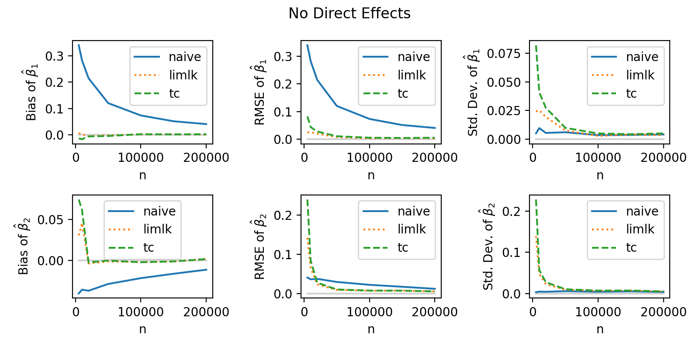

# Linear Proxy Metrics

This repo contains code to replicate and apply methods from our paper, ``Learning the Covariance of Treatment Effects Across Many Weak Experiments.''

## Instructions
1. Clone this repository.
2. (Optional) Create a virtual environment:
```{python}
python3 -m venv proxy_metrics_env
source proxy_metrics_env/bin/activate
```
3. Install the requirements, for example by running `python -m pip install -r requirements.txt`.
4. Run `python3 -m src.fig_1`.

## Example

